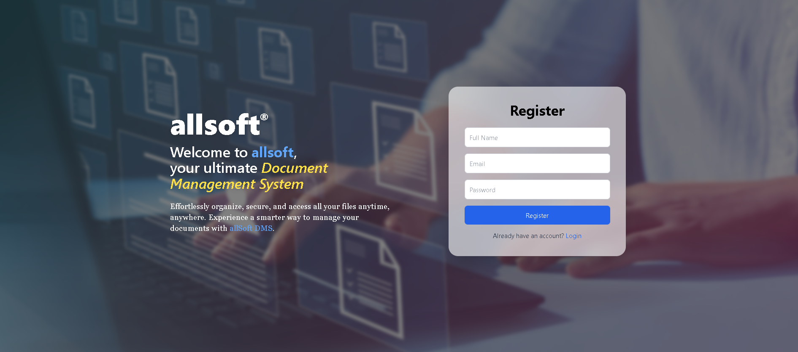
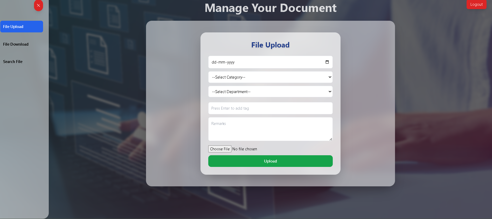
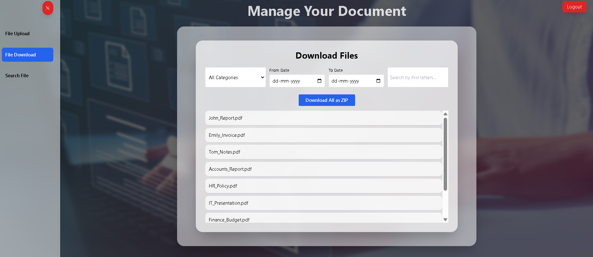
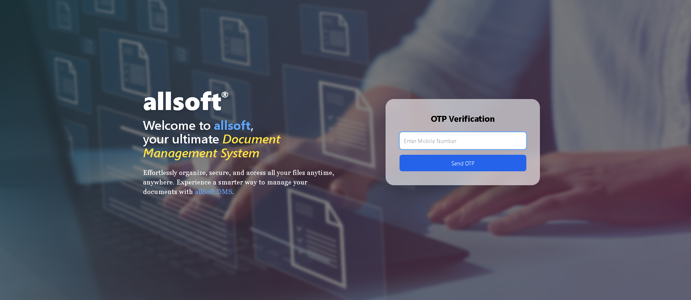

# 📂 Document Management System (DMS)

This project was bootstrapped with [Create React App](https://github.com/facebook/create-react-app).  
It is a simple Document Management System to upload, manage, and organize files.  

---

## 📸 Screenshots  

### 🔑 Authentication

  
  

### 📂 File Management

  
  

### 🔍 Search & Verification

  
  

### 🎨 Background

  

---

## 🚀 Available Scripts  

In the project directory, you can run:  

### `npm start`  
Runs the app in development mode.  

### `npm test`  
Launches the test runner in interactive watch mode.  

### `npm run build`  
Builds the app for production.  

### `npm run eject`  
Ejects the app configuration (not reversible).  

---

## 📖 Learn More  
- [Create React App Docs](https://facebook.github.io/create-react-app/docs/getting-started)  
- [React Docs](https://reactjs.org/)  
